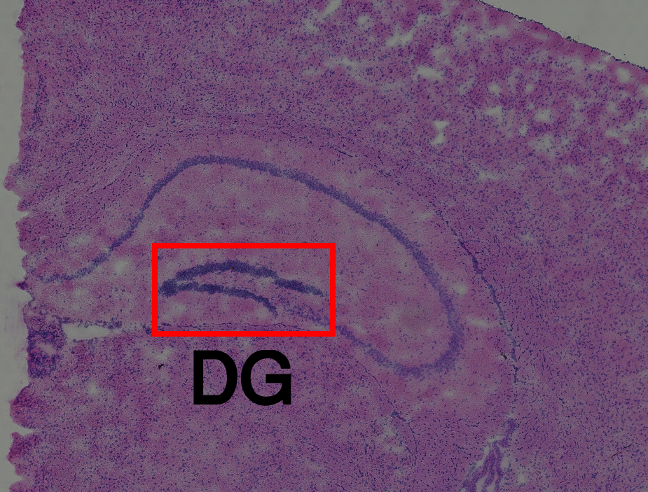
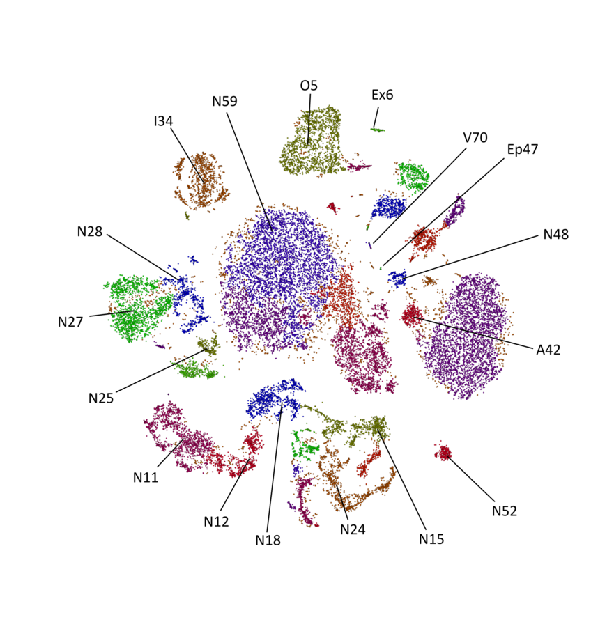

```{r setup, include=FALSE}
knitr::opts_chunk$set(echo = TRUE)
```

#Spatial Transcriptomics -- workshop for Visium data analysis
Welcome to the Spatial Transcriptomics workshop! 
It is based on a previous workshop of Alma Andersson, the same one who developed the single-cell and spatial data integration tool, Stereoscope and the materials from the publication of Bergenstråhle et al. (2020) and https://ludvigla.github.io/STUtility_web_site/.
During this workshop the idea is to get familiar with computational analysis part of a Spatial Transcriptomics / Visium data.

#Introduction
We will explore the field of Spatial Transcriptomics. Many of the ideas that you encountered when working with single cell data will be revistied but now with the advantage that we can visualize our results in the real physical space (not just UMAP or tSNE space). 

The field of spatial transcriptomics has grown rapidly, and multiple techniques to obtain information of spatial gene expression exists. Some examples are : MERFISH, ISS, osmFISH, seqFISH, HDST, baristaSeq, Slide-seq, and GeoMx. We will however be focusing on spatial data generated from the _Visium_ platform (sold by 10x Genomics). Visium is the successor to the technique - somewhat
confusingly - named Spatial Transcriptomics (commonly referred to as ST).

ST was developed at SciLifeLab and presented to the world in 2016 when the publication _Visualization and analysis of gene expression in tissue sections by spatial transcriptomics_  was published in the journal Science. In December2018, 10x Genomics aquired the IP rights to the ST-technique, they then launched the Visium platform in late 2019.

Both ST and Visium utilize a solid array onto which oligonucleotides with spatial barcodes have been printed at locations (spots) arranged in a regular grid. These oligonucleotides all have a poly-T sequence, making them apt to capture mRNA's by their poly-A tail. By reverse transcription, the barcodes of the oligonucleotides will be embedded in cDNA synthesized from the captured mRNA's; hence, we know at which mRNA that each transcript was captured. Once the cDNA molecules are sequenced, we can backmap them to their spatial position - using the barcodes - and by doing so obtain spatial gene expression information. The "old" ST arrays had 1000 spots printed on the array, while the newer Visium slides has 5000 spots.

One *key* fact that should be emphasized is how none of these methods (ST and Visium) operate on a single cell level yet. The gene expression data associated with each spot is really *a mixture of contributions from multiple cells*, not all necessarliy of the same cell type.

##Install packages

To analyse the gene count matrices, we will use a package called STUtility. It was published 2020 by Bergenstråhle et al. 
STUtility is based on Seurat, single-cell analysis tool, of which most of you probably have heard before. 
In addition, STUtility depends on plethora of other packages, so installing all the packages from the scratch will take some time. 
This code below checks that all the packages are installed and **should** install the ones missing. 
```{r, echo = FALSE, eval = TRUE}
# This chunk will:
# 1. Check if a package is installed
# 2. Install the package if it's missing
# 3. load the package

load.pkgs <- c("Seurat" = "cran",
               "sctransform"="cran",
               "ggplot2"="cran",
               "png"="cran",
               "grid"="cran",
               "topicmodels"="cran",
               "gridExtra" = "cran",
               "tm" = "cran",
               "gridExtra" = "cran",
               "dplyr" = "cran",
               "RColorBrewer"="cran",
               "hdf5r"="cran"
               )

installed.pkgs <- installed.packages()[,1]

for (pkg in names(load.pkgs) ) {
  if (!(pkg %in% installed.pkgs) ) {
    print(sprintf("Installing : %s",pkg))
    if (load.pkgs[pkg] == "cran") {
      install.packages(pkg)
    } else if (load.pkgs[pkg] == "bioc") {
          BiocManager::install(pkg)
    }
  }
  do.call("library",list(pkg))
}
library(STutility)
```

First things first: let's discuss about the data. For this tutorial we will use publicly available data from 10x Genomics Inc. We study two sagittal sections from mouse brain. (Available: https://support.10xgenomics.com/spatial-gene-expression/datasets)
From the website we have downloaded:
  1. Feature / cell matrix HDF5 (filtered and raw)
  2. Spatial imaging data (contains images, json files and tissue position lists)
  
*We encourage you to use other samples found from the web site. This tutorial should be fairly easy to apply all the tissues.*

In the folder WinterSchool2021 we have several different files. 

First, let's creat a Seurat object. For that we need .h5 files which are compact gene count matrices. Let's start with the raw data which is unfiltered and contains the data from all the spots, also outside of the tissue. We also need spotfiles which contain the positions of the tissue, imgs as bright field images from the tissue and json files as the spot coordinates. 
In addition, we can add sample  specific metadata, like section number or slide number. 

We load all this to the object using InputFromTable command:

#Loading the data
```{r}
#Collect file paths and metadata
samples <- list.files(path = " //genomic/ws_cell_dynamics/TP-SpacialTranscriptomic/WinterSchool2021", pattern = "raw_feature_bc_matrix.h5", recursive = TRUE, full.names = T)
spotfiles <- list.files(path = " //genomic/ws_cell_dynamics/TP-SpacialTranscriptomic/WinterSchool2021", pattern = ".csv", full.names = T)
imgs <- list.files(path = " //genomic/ws_cell_dynamics/TP-SpacialTranscriptomic/WinterSchool2021", pattern = "hires_image.png", recursive = T,full.names = T)
json <- list.files(path = " //genomic/ws_cell_dynamics/TP-SpacialTranscriptomic/WinterSchool2021", pattern = "json.json", full.names = T)
section <- c("1", "2")
slide <- c("V19L29-035", "V19L29-035")

#Create table for the metadata
infoTable <- data.frame(samples, imgs,spotfiles,json, section, slide, stringsAsFactors = F)

#Load the data based on infoTable
se <- InputFromTable(infotable = infoTable,
                     disable.subset = T)

```

#Lateral diffusion

When the tissue is permeabilized the RNA molecules should bind the probes directly under them. However, you expect to see some RNA molecules outside the tissue. 

*Q:* What is the importance of this?

We loaded raw data containing all ~5000 spots. Let's look at the spatial distribution of the unique molecules (nCount_RNA) and unique genes (nFeature_RNA):

```{r}
ST.FeaturePlot(se, features = c("nFeature_RNA"), dark.theme = T, cols = c("black", "darkblue", "cyan", "yellow", "red", "darkred"))
ST.FeaturePlot(se, features = c("nCount_RNA"), dark.theme = T, cols = c("black", "darkblue", "cyan", "yellow", "red", "darkred"))
```
*Q:* Do we see lateral diffusion?

Next, let's look at the ribosomal and mitochondrial gene expression patterns on tissue level. 

```{r}
#Extract mt genes and count the percentage of them in each spot
mt.genes <- grep(pattern = "^mt-", x = rownames(se), value = TRUE)
se$percent.mito <- (Matrix::colSums(se@assays$RNA@counts[mt.genes, ])/Matrix::colSums(se@assays$RNA@counts))*100

#Extract ribosomal genes and count the percentage of them in each spot
rp.genes <- grep(pattern = "^Rpl|^Rps", x = rownames(se), value = TRUE)
se$percent.ribo <- (Matrix::colSums(se@assays$RNA@counts[rp.genes, ])/Matrix::colSums(se@assays$RNA@counts))*100

#Visualisation of the spatial patterns
ST.FeaturePlot(se, features = "percent.mito", dark.theme = TRUE, cols = c("dark blue", "cyan", "yellow", "red", "dark red"))
ST.FeaturePlot(se, features = "percent.ribo", dark.theme = TRUE, cols = c("dark blue", "cyan", "yellow", "red", "dark red"))

#Violin plots of unique molecules, unique genes and mitochondrial and ribosomal conditions
VlnPlot(se, features = c("nFeature_RNA", "nCount_RNA", "percent.mito", "percent.ribo"), ncol = 4, pt.size = 0.05) 
```
*Q:* Why we see so high values outside the tissue? 
*Q:* How you interpret the Violinplots? 

#Spots under the tissue

Now, let's discard all the spots outside the tissue:

```{r}

#Load the data based on infoTable
se.tissue <- InputFromTable(infotable = infoTable)

```

In the data we still have spots which contains a lot of mitochondrial and ribosomal genes and spots which don't have many unique molecules.

*Q:* Why do we want to filter these spots?

We can visualize the distribution of the unique molecules and unique genes to help with the filtering. 

```{r}
p1 <- ggplot() +
  geom_histogram(data = se.tissue[[]], aes(nFeature_RNA), fill = "brown", alpha = 0.7, color = "gray", bins = 50) +
  ggtitle("Unique genes per spot")

p2 <- ggplot() +
  geom_histogram(data = se.tissue[[]], aes(nCount_RNA), fill = "brown", alpha = 0.7, color = "gray", bins = 50) +
  ggtitle("Total counts per spots")

gene_attr <- data.frame(nUMI = Matrix::rowSums(se.tissue@assays$RNA@counts), 
                        nSpots = Matrix::rowSums(se.tissue@assays$RNA@counts > 0))
p3 <- ggplot() +
  geom_histogram(data = gene_attr, aes(nUMI), fill = "brown", alpha = 0.7, color = "gray", bins = 50) +
  scale_x_log10() +
  ggtitle("Total counts per gene (log10 scale)")

p4 <- ggplot() +
  geom_histogram(data = gene_attr, aes(nSpots), fill = "brown", alpha = 0.7, color = "gray", bins = 50) +
  ggtitle("Total spots per gene")

cowplot::plot_grid(p1, p2, p3, p4)
```

Let's look again the mitochondrial and ribosomal gene patterns:

```{r}
mt.genes <- grep(pattern = "^mt-", x = rownames(se.tissue), value = TRUE)
se.tissue$percent.mito <- (Matrix::colSums(se.tissue@assays$RNA@counts[mt.genes, ])/Matrix::colSums(se.tissue@assays$RNA@counts))*100

rp.genes <- grep(pattern = "^Rpl|^Rps", x = rownames(se.tissue), value = TRUE)
se.tissue$percent.ribo <- (Matrix::colSums(se.tissue@assays$RNA@counts[rp.genes, ])/Matrix::colSums(se.tissue@assays$RNA@counts))*100

ST.FeaturePlot(se.tissue, features = "percent.mito", dark.theme = TRUE, cols = c("dark blue", "cyan", "yellow", "red", "dark red"))
ST.FeaturePlot(se.tissue, features = "percent.ribo", dark.theme = TRUE, cols = c("dark blue", "cyan", "yellow", "red", "dark red"))

VlnPlot(se.tissue, features = c("nFeature_RNA", "nCount_RNA", "percent.mito", "percent.ribo"), ncol = 4, pt.size = 0.05) 
```
*Q:* How would you define what to filter out?

#Filtering

Let's test some of values for the filtering:
_Comment_ : The Seurat package provides a subset method for Seurat objects but unfortunately this method will not work when using STUtility.

```{r}
#subset the Seurat object
se.subset <- SubsetSTData(se.tissue, expression = nFeature_RNA > 500 & percent.mito < 30)

#Visualise the filtered data
ST.FeaturePlot(se.subset, features = c("nFeature_RNA"), dark.theme = T, cols = c("black", "darkblue", "cyan", "yellow", "red", "darkred"))
ST.FeaturePlot(se.subset, features = c("nCount_RNA"), dark.theme = T, cols = c("black", "darkblue", "cyan", "yellow", "red", "darkred"))

```
*Q:* Is the data uniformly distributed? What could cause some of these differences?

#Protein-coding genes

If you want to remove certain gene types you can do so by list of genes. Here we keep only the protein-coding genes
_Comment_ : As the name indicated mouse_genes.tsv contains only the mouse genes, do not use for human samples. 
```{r}
ensids <- read.table(file = "mouse_genes.tsv", header = T, sep = "\t", stringsAsFactors = F)

# Print available biotypes
unique(ensids$gene_type)
keep.genes <- subset(ensids, gene_type %in% "protein_coding")$gene_name

# Subset Seurat object
se.subset.protcod <- se.subset[intersect(rownames(se.subset), keep.genes), ]

ST.FeaturePlot(se.subset.protcod, features = c("nFeature_RNA"), dark.theme = T, cols = c("black", "darkblue", "cyan", "yellow", "red", "darkred"))
ST.FeaturePlot(se.subset.protcod, features = c("nCount_RNA"), dark.theme = T, cols = c("black", "darkblue", "cyan", "yellow", "red", "darkred"))

```
*Q:* What advantages this creates? 

For this exercise let's continue with the object without protein-coding filter. 

#Image processing

Bright field images are the heart of the Spatial Transcriptomics. We align the reads to the images using know spot coordinates. STUtility does this in an automated manner. 

We can visualize the images and map the information included in metadata or any single gene. 

The image information is stored in the `Staffli` slot in the Seurat object.
Take a look at it using head(se@tools$Staffli[[]])

*Q:* What are different columns in the data? 

```{r}

#Load images to the object
system.time({se.subset <- LoadImages(object = se.subset, verbose = T)})

#Plot the raw images
ImagePlot(se.subset, method = "raster", darken = TRUE, type = "raw")

#Unique genes mapped on tissue
ST.FeaturePlot(object = se.subset, 
               features = c("nFeature_RNA"), 
               cols = c("dark blue", "cyan", "yellow", "red", "dark red"),
               ncol = 2, 
               grid.ncol = 1, 
               dark.theme = T)
```

```{r, fig.width=10, fig.height=5}
#Cck gene mapped on tissue
FeatureOverlay(se.subset, 
               sampleids = 1:2,
               ncols.samples = 2,
               features = "Cck", 
               pt.size = 0.75,
               cols = c("dark blue", "cyan", "yellow", "red", "dark red"), 
               dark.theme = T, 
               type = "raw")

```

*Q:* How we map the reads on the tissue? What image modifications are needed? Take a look at the `Staffli` slot in the object.

#Masking and alignment
Since we don't have spots on the background we can remove it and align the images. 
We use MaskImages command in which we can select the tresh hold which identifies the tissue. Test some channels to see the effect they do have. 
Alignment we can done in an automated or manual manner. He we show how the automated alignment works. You can try the manual alignment using ManualAlignImages

```{r}

#Mask and align the images
se.subset <- se.subset %>% MaskImages() %>% AlignImages()

#Visualise the masked and aligned images
ImagePlot(se.subset, ncols = 2, method = "raster", type = "masked", darken = T)
ImagePlot(se.subset, method = "raster", darken = TRUE, type = "processed", ncols = 2)

```

*Q:* Visualize some genes (for example Bbs1, Penk, Ap3b2, Prox1, Apoe) on aligned images.

#Manual annotation

If you want to select specific regions from the tissue, use ManualAnnotation to manually select the spots of interest

Try manually select the spots under Dentate Gyrus (DG) and separately the surrounding area of hypothalamus. 

_Comment_ : If your mouse brain anatomy is a bit rusty, the image below might help you to
identify where exactly the Dentate Gyrus (DG) is.


```{r}
#Uncomment if you are not knitting the file
#se.subset <- ManualAnnotation(se.subset)

```
*Q:* What type of analysis you can do with the annotations?

##Normalization

ST data being experimental data, we want to regress out batch effects. 

*Q:* What kind of batch effects you expect to see in the Visium data? 

We use SCTransform to normalize our data. There are other options like Harmony (https://github.com/immunogenomics/harmony) which requires running PCA before the normalization. 

SCtransform is an alternative to NormalizeData, FindVariableFeatures and ScaleData.
What do you see here?
Output format: Results in new SCT assay, counts corrected, log1p(counts) as data.

Possible batch effects check:-
Batch effects can bring unexplanable or even biased biological variations in the data.
  - Arise from multiple reasons, like different samples, storage times, different slides or different arrays within the same     slide
  - vars.to.regress option from the SCTransform removes these batch effects. We can state which batches to choose in this       option.
Make sure this 'batch' information is available in the meta.data before proceeding.

```{r}
#Default normalisation without any batch effects correction
se.subset <- SCTransform(se.subset)

#SCTransform with batch effect correction using 'section' and 'nFeature_RNA'
se.batch.section.cor <- SCTransform(se.subset, vars.to.regress = c("section", "nFeature_RNA"))

```

*Q:* Visualise the unique molecules and genes on normalized data. How does the results differ when you regress out more variables?
```{r}
#Write your code here

```
##Dimensionality reduction techniques

We can use factor analysis along with a variety of reduction techniques to fish out patterns of transcriptomic profiles.

Try with different combinations of nfactors and RUNXXX and see what happens.
nfactors = c(20,30)
RUNXXX <- PCA, TSNE, ICA, UMAP

*Q:* How different dimensionality reduction methods differ with the data you are using?

```{r}

se.subset <- RunNMF(se.subset, nfactors = 10)

```

```{r, fig.height= 15, fig.width=20}

cscale <- c("darkblue", "cyan", "yellow", "red", "darkred")
#Plot variable number of dimensions across the samples
ST.DimPlot(se.subset, 
           dims = 1:10,
           ncol = 2, # dimension level column setting
           grid.ncol = 2, # Sample level column setting
           reduction = "NMF",
           pt.size = 1, 
           center.zero = F,
           cols = cscale)
```

```{r}
#Print summary of most contributing genes
print(se.subset[["NMF"]])

#Barplot of the most contributing genes
FactorGeneLoadingPlot(se.subset, factor = 3, dark.theme = TRUE)
```

We can also view the most variable features/genes.

```{r, fig.width=10, fig.height=5}
head(se.subset@assays$SCT@var.features, 10)

most.var.genes <- se.subset@assays$SCT@var.features

fts <- c("Ttr", "Hba-a1", "Ptgds")
for (ftr in fts) {
  p <- FeatureOverlay(se.subset, 
                  features = ftr, 
                  sampleids = 1:2,
                  cols = c("darkblue", "cyan", "yellow", "red", "darkred"),
                  pt.size = 1.5, 
                  pt.alpha = 0.5, 
                  dark.theme = T, 
                  ncols.samples = 2)
                  print(p)
}
```

*Q:* How do they correlate between the number of unique molecules and genes? Can you see patterns?

Below is a UMAP embedding to compare the spatial distribution of previous gene.
Try with t-SNE embedding.

```{r, fig.width=6, fig.height=6}
se.subset <- RunUMAP(se.subset, reduction = "NMF", dims = 1:10, n.neighbors = 10)

#Gene list for plotting
fts <- c("Ttr", "Hba-a1", "Ptgds")

# Plot code for gene expression on visium coordinates
p3 <- ST.FeaturePlot(se.subset, features = fts, ncol = 2, grid.ncol = 1, pt.size = 1, show.sb = FALSE)
cowplot::plot_grid(p3, ncol = 1)
```

```{r, fig.width=15, fig.height=5}
# Plot code for gene expression on UMAP embedding
p.fts <- lapply(fts, function(ftr) {
  FeaturePlot(se.subset, features = ftr, reduction = "umap", order = TRUE)
})
cowplot::plot_grid(plotlist = p.fts, ncol = 3)
```


##Clustering 

An important part of Genome Analysis, we will use the most 'spatially' contributing dimensions from factor analysis in clustering.

Try with reduction = c(PCA, UMAP) and change resolution to force different amounts of clusters. 

```{r}
#construct Shared Nearest Neighbor (SSN) graph
se.subset <- FindNeighbors(object = se.subset, verbose = FALSE, reduction = "NMF", dims = 1:10)

se.subset <- FindClusters(object = se.subset, verbose = FALSE)

library(RColorBrewer)
n <- 19
qual_col_pals = brewer.pal.info[brewer.pal.info$category == 'qual',]
col_vector = unlist(mapply(brewer.pal, qual_col_pals$maxcolors, rownames(qual_col_pals)))

ST.FeaturePlot(object = se.subset, features = "seurat_clusters", dark.theme = T, cols = col_vector, pt.size = 1)
```

If clusters seem cluttered, then view each cluster using 'split.labels = T' but for only one section at a time.

Try with indices = 2, for section 2/sample 2

```{r, fig.width=8, fig.height=7}
ST.FeaturePlot(object = se.subset, features = "seurat_clusters", pt.size = 0.5, split.labels = T, indices = 1, show.sb = FALSE)
```

##Differential Expression Analysis (DEA)

We can look at the most differentially expressed genes across the tissue, also termed here as Markers.

ident.1 selects the cluster ID/number where we want to look at the differentially expressed genes/markers.

Try with other clusters as well.

```{r}
diff.genes <- FindMarkers(se.subset, ident.1 = 1) #this step will take a couple of minutes to finish
head(diff.genes)
```

We can also look at the expression of one gene of interest across the 'rest' of the samples by using FeatureOverlay.

Try with other genes.

```{r, fig.width=10, fig.height=5}
FeatureOverlay(se.subset, features = "Plp1", 
              sampleids = 1:2,
              
              cols = c("darkblue", "cyan", "yellow", "red", "darkred"),
              pt.size = 1.5, 
              pt.alpha = 0.5,
              ncols.samples = 2)
```
*Q:* How can you use this information? 

##Spatial Autocorrection

We can find genes with spatial patterns across the tissue. STUtility uses neighborhood networks to provide an overall expression of a gene relative to it neighborhood. Each gene's original expression and this new relative expression is calculated. All genes are then further ranked based on this data frame of gene expression vectors.

```{r}
library(spdep)
neigh.genes <- CorSpatialGenes(se.subset)
```

View a summary of the neigh.genes

```{r}
neigh.genes
```

```{r}
#Save the object
saveRDS(se.subset, file = "se_subset.rds")
```


## Factor Analysis

When clustering our spots, we will group together spots with similar expression
profiles (they reside near each other in gene expression space). But remember
how we in the introduction mentioned that each spot's expression profile is a
mixture of contributions from multiple cells. Thus, it is sometimes more
interesting to know what the constituents of these mixtures are and how they are
distributed within the data.

To approach this question, we can consider each spot as a combination of some
latent - unobserved - factors. These factors, depending on how we design the
model, could represent transcription programs or alternatively cell types. In
contrast to a spot being assigned to a single cluster, it is defined by the
composition of different contributions from respective factor. The process of
retrieving and characterizing these factors, might be referred to as a form of
**decomposition** or **factorization**.

Such factors can be learned from the data, but also defined _a priori_; a good
example of the latter is when single cell data is integrated with spatial data
(next section) - we can then consider the cell types associated expression
profiles as latent factors. However, for now, we will focus on the case when we
do not know the character of our factors prior to the analysis.

There is a plethora of different methods to conduct factor analysis or modeling
of similar problems, some of them designed specifically with gene expression
data in mind. Since more complex models tends to take longer time to fit and
converge, we will use a relatively simple form of factorization called Latent
Dirichlet Allocation (LDA) - borrowed from the field of topic modelling.

LDA was first presented in 2003 (Blei et al.), the original problem it
was designed to solve can be described as: 

> "Given a corpus of 𝑀 documents, with a vocabulary consisting of 𝑉 words,
assume each document can be assigned to one or more of 𝑇 topics. Each topic 𝑡
is characterized by its frequency distribution over the 𝑉 words. How are the
words distributed across the topics and how are the topics distributed across
the documents?"

If we consider this in the context of spatial transcriptomics, we can see how an
alternative formulation could be stated as :

> "Given a section with 𝑆 spots, with a total of 𝐺 genes being expressed
across all spots, assume each spot can be assigned to one or more of 𝑃
expression programs. Each program 𝑝 is characterized by its frequency
distribution over the 𝐺 genes. How are the genes distributed across the
expression programs and how are the programs distributed across the spots?"

Despite being described as "simple", the LDA model takes a fairly long time to
fit and scales poorly with the number of genes, therefore we will only use the
top 5000 highest expressed genes (based on the raw, not normalized data).

*Q:*  Create a vector named `top.5000` that contains the names of the top 5000
genes w.r.t. total gene expression.

_Comment_: You want to use the assay "RNA" and not "SCT" for this. This is
because LDA operates with frequency distributions of words, computed from the
number of times each word (here gene) occurs in every document (spot) - thus
using normalized data wouldn't make any sense.

```{r,eval = GRADE_MODE}
# create the vector top.5000 here


```

The next code chunk provides code that convert the data into a suitable format
for the LDA implementation to use, and then fits the model. It uses $10$ topics,
this number is chosen quite arbitrarily.

Now, you can have a look at the code below but *DO NOT RUN IT*. The fitting
procedure will take about 1 hour on a good computer, so to avoid you wasting
valuable time on a slow algo - skip ahead to the next code chunk where you can
load an already fitted model (using the code in this chunk).

```{r, eval = FALSE}
# DO NOT RUN

# Code to prepare data for the LDA algorithm
# and the actual fitting of the model

# construct a Term times Document Matrix from our count data
tdm <- as.TermDocumentMatrix(GetAssayData(subset(se.subset,features = top.5000),
                                          assay = "RNA"),
                             weighting = "weightTf"
                             )
# get frequency weights
tdm <- weightTf(tdm)

# convert Term times Document to Document times Term Matrix
# desired input to LDA function
dtm <- as.DocumentTermMatrix(tdm)
                             
# run LDA with 10 topics 
lda.res <- LDA(dtm,
               k = 10)


```

Run he code chunk below to load a fitted model

```{r}

# load an already fitted model

lda.res <- readRDS("lda-res.Rds")
lda.res
```

So the model has now been fitted with $10$ topics (gene expression programs). In
contrast to the clustering - where each spot has one label (cluster id) - they
now have a value for every topic representing the *proportion of transcripts* in
a spot that originates from respective topic. These proportion values are found
in the ot of the `lda.res` object.


```{r,  spatially.fig.width=12, fig.height=10}

# list to store plots
plot.list <- list()
# iterate over each of the ten topics
for (topic in 1:10) {
  # generate plot
  plot.list[[topic]] <- ST.FeaturePlot(se.subset,
                                     color.vector = lda.res@gamma[,topic],
                                     plot.title = paste("Topic",topic),
                                     legend.title = "proportion"
  )
}
  
# arrange plots in grid and plot
grid.arrange(grobs = plot.list,
             ncol = 4)

```

*Q:* Compute the rowsums of the `gamma` slot in `lda.res`, inspect your result and answer the following questions:

1. The rowsums are all identical, what is the value that all sums share?

2. *Why* do all rows sum to this value?


Now what's even neater with LDA is that in addition to topic distribution among
spots, it also fits the word (gene) distribution among topics. Meaning that we
can see which genes that are very frequently observed (and thus charateristic)
within each topic. More precisly the `beta` slot of our `lda.res` object holds
the logged (normal logarithm) probabilities of a word being sampled from a
specific topic.

Topic 9 - concentrated to the CA 1-3 regions and the dentate gyrus - looks sort
of interesting, let us therefore see what $20$ genes that are most strongly
associated with this topic.

```{r}

# get the indices of the top 20 most frequent genes of topic 9
top.topic.9 <- order(lda.res@beta[9,],decreasing = T)[1:20]
# create a data frame with gene names and probabilities
top.topic.9 <- data.frame(gene = lda.res@terms[top.topic.9],
                             prob = exp(lda.res@beta[9,top.topic.9])
                             )

top.topic.9
```

If you were to run a pathway/enrichment analysis on this set of genes (i.e.,
looking what sort of biological functions and pathways that it can be associated
with), we'd see terms like "synapses","cell junctions","dendritic spine",
"proton transmembrane transporter activity", etc. This makes sense since the
regions Topic 9 is most dominant in are heavily involved in the formation and
retreival of new memories as well as processing of neuronal signals.

*Q:* Create a data frame called `top.2.genes` with the *top 2* genes of each
topic. This data frame should have the columns: "gene","prob" and "topic",
containing the following information:

* gene - name of the gene
* prob - probability of being sampled from the asssociated topic
* topic - the topic to which the gene is associated

_Hint 1_: the names of the genes can be accessed by `lda.res@terms`. As you saw
in the code chunk above.

_Hint 2_: It might be a good idea to use a for loop here. However, it's not a
must, there are multiple ways of solving this exercise!

_Hint 3_: If you want append an element to a vector, you simply do 
`my.vector <- c(my.vector,new.element)`

```{r,eval = GRADE_MODE}
#Write your code here
```

## Single Cell Integration

The idea of factor decompisition is attractive, but there are still some
challenges to this approach. The factors (what we referred to as topics before,
factor is a more general term), do not necessarily represent specific cell types
and we have no immediate biological interpretation of them.

What if we wanted to where a specific type of Neurons or Astrocytes (common cell
types in the brain) are located in our spatial data; then we would have to hope
that some of our factors correspond to these types (which there is no guarantee
of) and then try to figure out which factors that would be. Not the most robust
approach, right?

A solution this problem is to use a form of guided factor decomposition, where
we already know our factors but are interested how they are distributed across
the spots. In the case of localizing cell types, these factors would be
expression profiles from each individual cell type that we are interested in.
But from where would be obtain such information? The answer comes in the form of
a different type of data, namely _single cell RNA-seq_. 

In single cell experiments, each data point corresponds to one individual cell
(once duoublets have been removed). This means that if we assign an identity
(e.g., cell type or cluster), we can learn the expresion profiles and then
deconvolve our spatial data with them.

Multiple strategies exists to "map" single cell information onto the spatial
data, but we will use output from a tool called `stereoscope` (from the paper
_"single-cell and spatial transcriptomics enables probabilistic inference of
cell type topography"_ in Nature Communications Biology), the software is found
at [github](https://github.com/almaan/stereoscope). In short this method models
both single cell and spatial data as _Negative Binomial_ (NB) distributed, then
for every gene infers the paramters of each cell type's distribution, to finally
find the optimal combination of cell types in each spot based on Maximum a
Posteriori estimation.

To map cell types from single cell data onto the tissue, we need a good single
cell data set which is at least _somewhat similar_ to our spatial data, i.e.
where we expect the same set of cell types to be present in both data sets.

Fortunately for us, there is a website called `mousebrain.org` where *a lot* of
single cell data from the mouse brain is avialable. One of the single cell data
sets (from the hippocampal region) is visualized (in gtSNE-space, similar to our
UMAP-embedings). In the letter+number combinations, the letter indicates cell
type identity of the cluster while the number indicates different subtypes of the
broader cell type classes. The letters are to be interpreted accordingly:

* N - Neurons
* A - Astrocytes 
* V - Vascular cells
* I - Immune cells
* O - Oligodendrocytes
* Ep - Ependymal cells
* Ex - Excluded from single cell study



Now `stereoscope` is a probabilistic model that takes quite a lot of time to
fit, and you usually need GPU resources for it to run in reasonable time.
Therefore you will load the output of `stereoscope` when applying it to the
aforemention single cell data set and the section

```{r}
# Load stereoscope analysis results

# get data from file
stsc <- read.table("stereoscope-results.tsv",
                   sep = '\t',
                   row.names = 1,
                   header = 1)
# transpose to have features as rows and spots as columns
stsc <- t(stsc)
# ad a new assay called stereoscope to our se object
se[["stereoscope"]] <- CreateAssayObject(counts = stsc)

# set the default assay to stereoscope
DefaultAssay(se) <- "stereoscope"
# inspect data
GetAssayData(se)[1:5,1:5]

```

The values in the output from `stereoscope` represent proportion values, that
is: the proportion of cells at each spot that is estimated to belong to a
certain cell type. The cell types present in our data are:

```{r}

cat(paste(rownames(se.subset), collapse = ", "))

```

Now how about having a look at the spatial distribution of the celltypes:

* Ependymal-47
* Neurons-27
* Neurons-59

our beloved `spatial.plot` comes in handy again

```{r}

# specify cell types to plot
plot.types <- c("Ependymal-47",
                "Neurons-27",
                "Neurons-59")
# list to hold our plots
plot.list <- list()

# iterate over each specified cell type
for (cell.type in plot.types){
  # get vector of cell type proportion values
  color.vector <- GetAssayData(se.subset)[cell.type,]
  # generate plot
  plot.list[[cell.type]] <- ST.FeaturePlot(se.subset
                            )
  
}
# arrange plots in grid
grid.arrange(grobs = plot.list,
             ncol = 3)


```

So now we know how these 3 cell types localize in the tissue, but with 56 types
in total it can be a bit hard get a comprehensive overview of all the types.
Especially if we want to start assess paterns of interaction and
co-localization, which is often of great interest to know. To exemplify, if we
were to plot every pair of cell types in order to see if they had similar
spatial distributions, we have to look through $56!/(54!2!) = 1540$ pairs...
which is in the upper bounds of "quite a lot".

In order to condense the rich information that the single cell mapping has given
us, we can instead look at the (Pearson) correlation of the proportion values
between different cell types. This will tell us which cell types that have
similar spatial distributions (co-localizing) as well as which types that tend
to populate different regions.

We will compute these correlation values - cast as a correlation matrix - and
then visualize them in a heatmap.


```{r, fig.width=10,fig.height=10}
# generate a color palette
color.pal <- rev(colorRampPalette(brewer.pal(11,"RdBu"))(nrow(se)))
# compute pearson correlation of cell types across spots
cors <- cors <- GetAssayData(se) %>%
  as.matrix() %>%
  t() %>% 
  cor()
# set diagonal to NA
diag(cors) <- NA
# generate heatmap and plot it
heatmap(cors,
        col = color.pal,
        scale = "none",
        verbose = F,
        breaks=seq(-1, 1, length.out=length(color.pal) +1)
        )
```


From this we can see that the celltypes "Neurons-10" and "Neurons-15" seem to
have a high degree of co-localization, among many other pairs. To assess whether
this makes sense we can plot their spatial distribution using `spatial.plot`.

*Q10*: Plot the spatial distribution of the two cell types "Neurons-10" and
"Neurons-15", like we did for the cell types "Ependymal-47", "Neurons-27" and
"Neurons-59"; you are welcome to take inspiration from the code used before.

```{r,eval =GRADE_MODE}

# Write the code to plot the spatial distribution of
# the cell types Neurons-10 and Neurons-15 here

plot.types <- c("Neurons-15","Neurons-10")
plot.list <- list()

for (cell.type in plot.types){
  color.vector <- GetAssayData(se.subset)[cell.type,]
  plot.list[[cell.type]] <- ST.FeaturePlot(se
                            )
  
}

grid.arrange(grobs = plot.list,
              ncol = 2)
```

